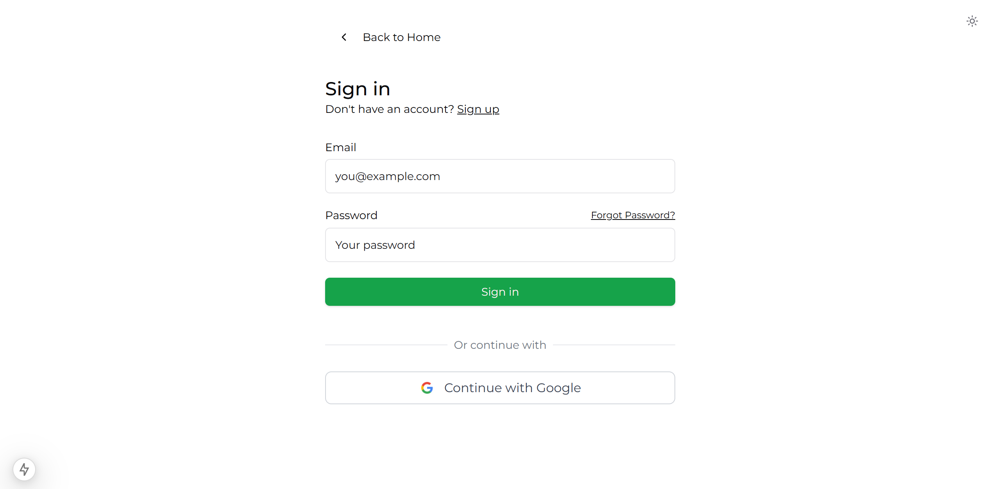
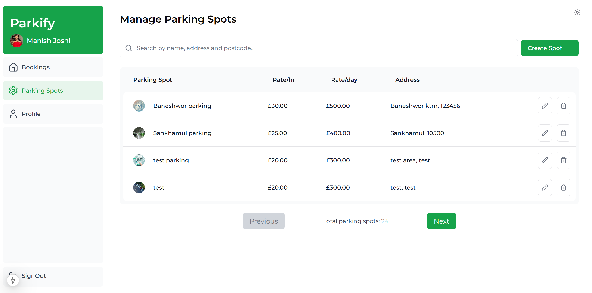
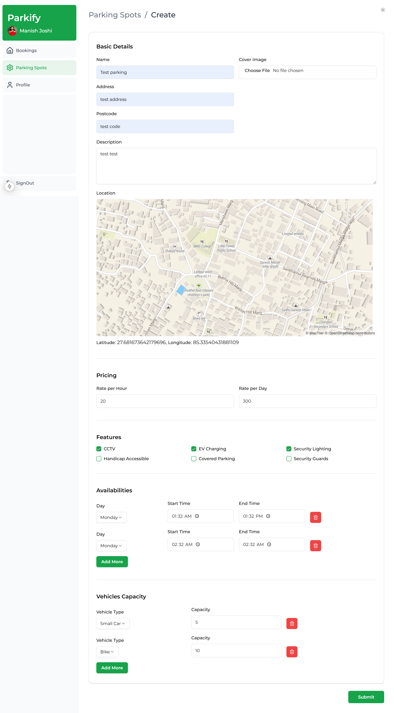
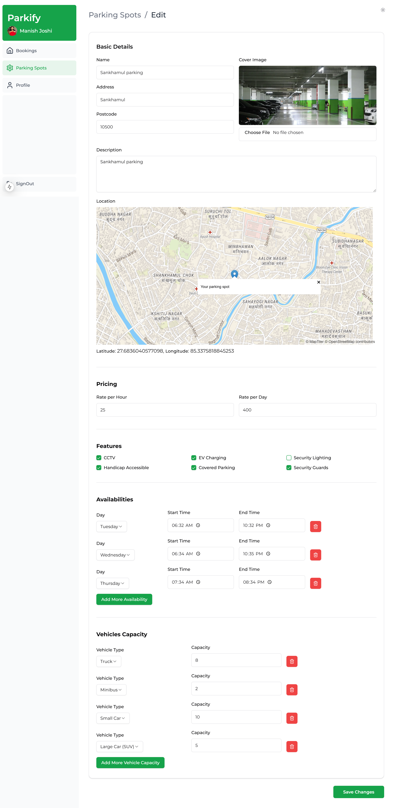
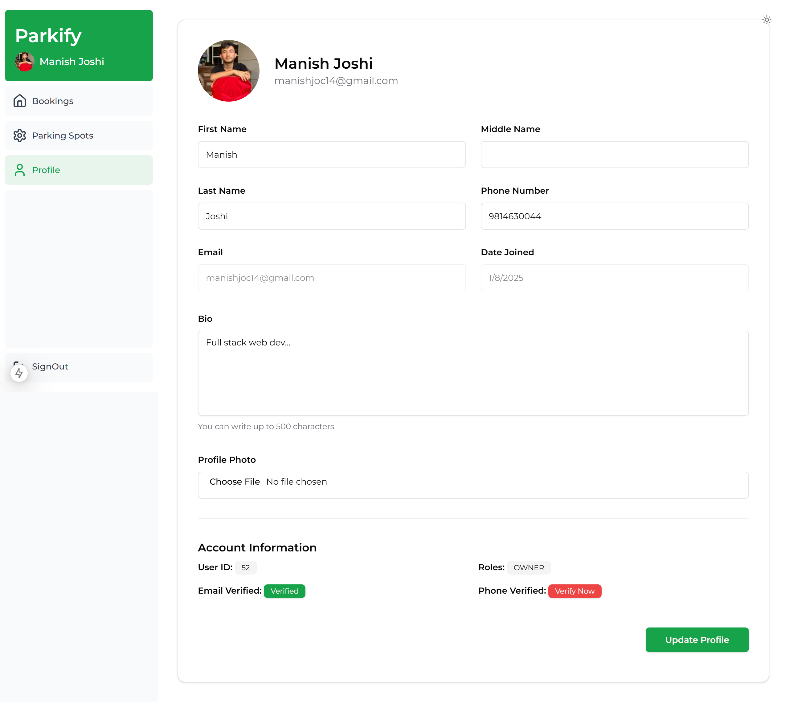
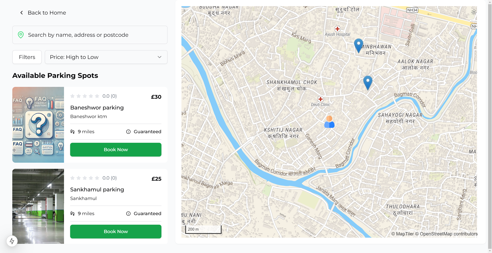

# Parkify

🚗 **Find, Filter, and Book Parking Effortlessly!**

Parkify is a powerful and user-friendly parking management platform where users can **find, filter, and book** parking spots for their vehicles. It features advanced filtering, distance-based sorting, and seamless booking options. Admins can **manage bookings, add/update parking spots, and monitor user activity** efficiently.

---

## 🌟 Features

### 🚀 User Features

- 🔍 **Find & Book Parking**: Search for parking spots based on availability, location, and preferences.
- 📍 **Advanced Filtering & Sorting**: Filter by price, availability, vehicle type, and sort by distance.
- 🕒 **Time-Based Booking**: Reserve a parking spot within a specific time frame.
- 🗺 **Interactive Map (React Leaflet)**: View available parking spots on a dynamic, embedded map.
- 🌙 **Dark Mode Support**: Enjoy a seamless experience with built-in dark mode.
- 🔐 **Authentication**:
  - Google OAuth
  - Email/Password Signup & Login
- ⭐ **Feedback System**:
  - Users can give feedback on parking spots.
  - Users can also provide website feedback.
- 📩 **Newsletter Subscription**: Stay updated with new features and promotions.

### 🛠 Admin Features

- 📊 **Dashboard**: View and manage bookings.
- ✅ **Manage Booking Status**: Approve, reject, or cancel user bookings.
- 🏗 **Parking Spot Management**:
  - Add new parking locations.
  - Update existing parking details.
  - Delete parking spots when necessary.
- ✏️ **Profile Management**: Update personal admin details.

---

## 🏗 Tech Stack

### 🎨 Frontend & Backend

- [Next.js](https://nextjs.org/) (Full-stack framework for React)
- [TailwindCSS](https://tailwindcss.com/) (Utility-first CSS framework)
- [shadcn/ui](https://ui.shadcn.com/) (Modern UI components)
- [React Leaflet](https://react-leaflet.js.org/) (Map visualization)

### 💾 Database & Authentication

- [Supabase](https://supabase.io/) (PostgreSQL as a hosted database)
- PostgreSQL (Relational database management system)
- Google OAuth (Third-party authentication)
- Email & Password Authentication

---

## 🎬 Getting Started

### 🚀 Installation

1. Clone the repository:

   ```bash
   git clone https://github.com/yourusername/parkify.git
   cd parkify
   ```

2. Install dependencies:

   ```bash
   npm install
   # or
   yarn install
   ```

3. Set up environment variables in a `.env.local` file:

   ```env
   NEXT_PUBLIC_SUPABASE_URL=your_supabase_url
   NEXT_PUBLIC_SUPABASE_ANON_KEY=your_supabase_anon_key
   NEXTAUTH_SECRET=your_nextauth_secret
   GOOGLE_CLIENT_ID=your_google_client_id
   GOOGLE_CLIENT_SECRET=your_google_client_secret
   ```

4. Run the development server:

   ```bash
   npm run dev
   # or
   yarn dev
   ```

5. Open [http://localhost:3000](http://localhost:3000) in your browser.

---

## 📸 Features Preview

- **Home Page** 
- **Sign In Page** 
- **Manage Parking Spots Page** 
- **Create Parking Spot Page** 
- **Edit Parking Spot Page** 
- **Admin Profile Page** 
- **Admin Bookings Page** 
- **Find Parking Page** 
- **User Booking Page** 

---

## 🛠 Future Enhancements

- 📱 **Mobile App** version using React Native.
- 🏷 **Dynamic Pricing System** for parking spots.
- 📍 **Real-time location** for nearest parking suggestions.
- 💳 **In-app Payments** for easy transactions.

---

## 🧑‍💻 Contributing

Contributions are welcome! To contribute:

1. Fork the repository.
2. Create a feature branch (`git checkout -b feature-name`).
3. Commit your changes (`git commit -m 'Added new feature'`).
4. Push to the branch (`git push origin feature-name`).
5. Open a Pull Request.

---

## 📫 Contact

For any inquiries or feedback, feel free to reach out:

- 📧 Email: [manishjoc14@gmail.com](mailto:manishjoc14@gmail.com)
- 🐦 Twitter: [@manish_joshi14](https://twitter.com/manish_joshi14)
- 🌐 Website: [manish-joshi.vercel.app](https://manish-joshi.vercel.app/)

---

⭐ **If you like this project, don't forget to give it a star!** ⭐

